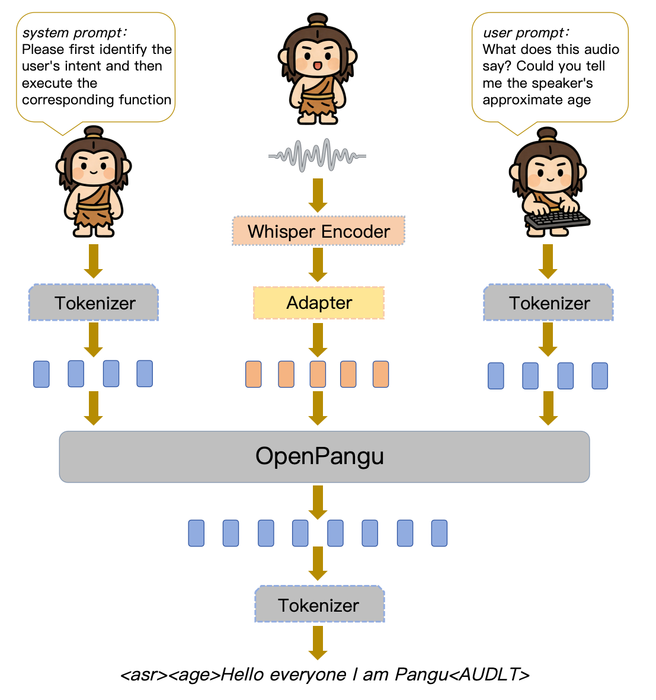

<p align="center">
   <h1>OSUM-Pangu: An Open-Source Multidimension Speech Understanding Foundation Model Built upon OpenPangu on Ascend NPUs</h1>
<p>

Yujie Liao, Xuelong Geng, Hongfei Xue, Shuiyuan Wang, Lei Xie

<p align="center">
    
<p>

<p align="center">
    <a href="https://huggingface.co/ASLP-lab/OSUM-Pangu"> Ckpt ｜ <a href="https://arxiv.org/abs/2603.10862"> Paper</a>
</p>

Recent advancements in Speech Large Language Models have significantly enhanced multi-dimensional speech understanding. However, the majority of high-performance frameworks are predominantly optimized for GPU centric ecosystems and proprietary backbones, creating a significant gap for deployment on non-CUDA computing infrastructures. In this paper, we present OSUM-Pangu, a fully open-source speech understanding foundation model developed on a completely non-CUDA software and hardware stack. By integrating an audio encoder with the openPangu-7B LLM backbone, we successfully implement the entire training and inference pipeline on the Ascend NPU platform. To facilitate efficient task alignment under non-CUDA resource constraints, we adopt a practical training process that sequentially bridges speech perception and user intent recognition. Experimental results demonstrate that OSUM-Pangu achieves task accuracy comparable to mainstream GPU-based models while maintaining robust natural language interaction capabilities. Our work provides a reproducible, non-CUDA baseline for the open-source speech community, promoting the independent evolution of multimodal intelligence.

---

## Architecture

The overall architecture of OSUM-Pangu is shown below:

<p align="center">
    
<p>

The model mainly consists of three components:

### 1. Speech Encoder
Whisper-medium  
Responsible for extracting speech representations.

### 2. Adapter
Transforms acoustic features into tokens compatible with the LLM input space.

### 3. Intent-aware LLM

<p>
    <a href="https://huggingface.co/FreedomIntelligence/openPangu-Embedded-7B-V1.1"> openPangu-Embedded-7B-V1.1 </a>
</p>


Responsible for:
- Parsing natural language instructions
- Identifying user intent
- Determining which speech task to execute

---

## Training Strategy

We adopt a a three-stage training proces, illustrated below:

<p align="center">
    
<p>

### Stage 1: Speech Understanding Alignment

Goal: Equip the model with multi-task speech understanding capability.

Characteristics:

- Only speech-related modules are trained
- Establish strong acoustic representation ability

---

### Stage 2: Intent Understanding

Goal: Enable the model to understand natural language user instructions.

Examples:

Please transcribe this audio.  
Analyze the speaker's emotion.  
Identify what event happens in the audio.

The model learns:

- Instruction semantic understanding
- Task mapping capability

---

### Stage 3: Joint Instruction Tuning

In the final stage, joint training allows the model to:

- Automatically parse user instructions
- Identify task types
- Execute the corresponding speech understanding tasks

Without requiring fixed templates, such as:

What is the emotion of this speech?  
Can you transcribe this audio?  
What event happens in the audio?

The model can correctly understand and execute all of them.

---

## Results

### Dataset Configuration

Our experiments follow the task definitions of the OSUM framework. To maintain the linguistic reasoning capability of the backbone, we incorporate 2M entries from Alpaca-CoT for text-based interactions, with queries synthesized using CosyVoice 2. To evaluate the model's robustness in real-world scenarios, we utilize an Intent-Instruction Set (IIS) containing over 80k training samples and 4k test prompts, covering diverse colloquial user queries.


---

### Multi-task Speech Understanding Performance

OSUM-Pangu demonstrates competitive performance across diverse tasks compared to GPU-based baselines Qwen2-Audio and OSUM, proving the effectiveness of the NPU-based pipeline.


| Task       | Model          | Public Test Set                                                                 | Metric       | Public Result                                                                 |
|------------|----------------|---------------------------------------------------------------------------------|--------------|-------------------------------------------------------------------------------|
| **ASR**    | Qwen2-Audio    |                                                                                 | WER/CER (%)  | 8.84 / 8.40 <br> 3.0 / 3.0 / 2.9 <br> **1.6 / 3.6**                           |
|            | OSUM           | WenetSpeech(n/m) <br> AISHELL-2(m/i/a) <br> LibriSpeech (c/o)                   |              | 6.46 / **5.34** <br> **2.81 / 2.75 / 2.73** <br> 2.19 / 5.53                  |
|            | **OSUM-Pangu** |                                                                                 |              | 7.40 / 10.49 <br> 3.01 / 2.98 / 2.95 <br> 3.51 / 8.36                         |
| **VED**    | Qwen2-Audio    | VocalSound                                                                      | ACC (%)      | **93.3**                                                                      |
|            | OSUM           |                                                                                 |              | 82.58                                                                         |
|            | **OSUM-Pangu** |                                                                                 |              | 73.04                                                                         |
| **SER**    | Qwen2-Audio    | MELD-test <br> MER2023                                                          | ACC (%)      | 55.3 / --                                                                     |
|            | OSUM           |                                                                                 |              | 53.38 / 86.43                                                                 |
|            | **OSUM-Pangu** |                                                                                 |              | 36.40 / **89.19**                                                             |
| **SGC**    | Qwen2-Audio    | Kaggle-CommonVoice test                                                         | ACC (%)      | 97.25                                                                         |
|            | OSUM           |                                                                                 |              | **99.41**                                                                     |
|            | **OSUM-Pangu** |                                                                                 |              | 97.48                                                                         |
| **SAP**    | Qwen2-Audio    | Kaggle-CommonVoice test                                                         | ACC (%)      | 35.53                                                                         |
|            | OSUM           |                                                                                 |              | 76.52                                                                         |
|            | **OSUM-Pangu** |                                                                                 |              | **83.31**                                                                     |

---

### Instruction Following Performance (IFR)

Instruction Following Rate (IFR) measures the ability of the model to parse natural language instructions and execute the corresponding tasks.

The metric is defined as:

$$
IFR = \left( \frac{N_{correct}}{N_{total}} \right) \times 100\%
$$

where:

- $N_{correct}$ represents the number of correctly executed instructions  
- $N_{total}$ represents the total number of evaluation samples
Compared with mainstream open-source models, OSUM-Pangu achieves significantly better performance:


| Model                     | IFR (\%)  |
|---------------------------|-----------|
| Qwen2Audio-Instruct       | 71.3      |
| **OSUM-Pangu (Ours)**     | **90.2**  |

---

### Flexibility vs Accuracy

We evaluate whether natural language instructions (NL) degrade performance compared to fixed instructions (FI).

Results show that the model maintains strong flexibility while preserving task accuracy.


| Task  | Test                          | FI        | NL        | $\Delta$   |
|:---- |:---------------------------- |:-------- |:-------- |:--------- |
| ASR   | test-net/librispeech-clean    | 7.36/3.64 | 7.40/3.51 | +0.04/-0.13 |
| SER   | Test<sub>emotion</sub>        | 67.39     | 67.41     | +0.02      |
| SGC   | Test<sub>gender</sub>         | 97.04     | 96.02     | -1.02      |
| SRWT  | Test<sub>align</sub>          | 22.39     | 17.52     | -4.87      |
| SSR   | Test<sub>style</sub>          | 62.79     | 58.05     | -4.74      |
| VED   | Test<sub>event</sub>          | 77.74     | 73.04     | -4.70      |
| SAP   | Test<sub>age</sub>            | 71.75     | 72.86     | +0.11      |

---

Conclusion:

Only minor performance drops appear in relatively niche tasks such as:

- Style recognition
- Event detection

Core tasks such as:

- ASR
- SER
- SAP

remain almost unchanged, validating the effectiveness of the three-stage training process.

---


### Speech-to-Text Chat (STTC) Capability

We further evaluate the model in conversational reasoning scenarios.

OSUM-Pangu outperforms GLM-4-Voice on the TriviaQA and WebQ benchmarks.

| Model               | LLaMA Q | TriviaQA | Web Q |
|:------------------ |:------: |:-------: |:----: |
| ChatGPT-4o          | 71.7    | 69.7     | 51.6  |
| GLM-4-Voice         | 50.7    | 26.5     | 15.9  |
| DeepTalk            | 59.7    | 27.5     | 23.1  |
| OSUM-EChat          | 55.3    | 33.7     | 30.4  |
| **OSUM-Pangu**      | 44.6    | 28.9     | 29.5  |


---

## How to Use the OSUM-Pangu Framework for Training and Inference

### Environment Setup

Before starting, please ensure that your device supports **NPU** and the Python environment is properly configured.

We recommend running the code on a Linux system.

If Conda is not installed, please refer to:
https://blog.csdn.net/qq_41636123/article/details/130266232

```bash
# Create a new conda environment
conda create -n osum_pangu python=3.10
conda activate osum_pangu

# Clone the repository
git clone https://github.com/ASLP-lab/OSUM-Pangu.git
cd OSUM-Pangu

# Install dependencies
pip install -r requirements.txt -i https://pypi.tuna.tsinghua.edu.cn/simple
```

### Model Download
```python
from huggingface_hub import snapshot_download

snapshot_download(
    repo_id="ASLP-lab/OSUM-Pangu",
    local_dir="path",
    local_dir_use_symlinks=False,
    endpoint="https://hf-mirror.com"
)
```
### Inference
This project provides batch inference scripts for all tasks under in ：OSUM-Pangu/infer_code:

```shell
python infer_ASR.py
```
### Training
To ensure a smooth training process, please follow the steps below.
#### 1. Data Preparation
Data can be prepared in three formats:

raw、shard、combine

Recommended: shard format

After preparing the dataset, write the generated data index into the following configuration file:
```yaml
OSUM-Pangu/conf/data_s2t_tmp.yaml
```
#### 2. Start Training

Run the main training script:
```bash
OSUM-Pangu/train.sh
```